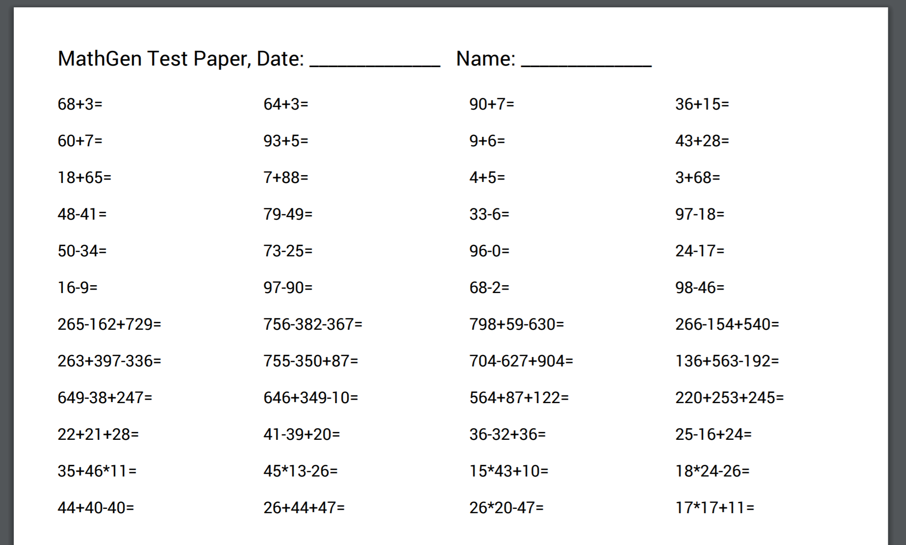

# Math Test Paper Generator

Generate simple arithmetic test questions

`mathgen` is a math test paper generator outputs as PDF paper with answers,
currently support simple arithmetics including addition,
subtraction, multiplication and division. You can also
set difficulties such as no negatives and no greater than 999, etc.

To generate example paper try included "ks2" config file:



```bash
mathgen ks2.yaml -t "KS2 Simple Arithmetics" -o ks2.pdf -a ks2-answers.pdf
```

### Yaml config

```yaml
meta:
  author: William Yang
  date: 2021-02-14
  version: v1
  label: ["ks2", "year4", "year5"]
  year: [4,5]

generators:
  - type: arithmetic
    quantity: 12
    params:
      operations: ["+"]
      nums: [0,99]
      len: 2
      max: 100
  - type: arithmetic
    quantity: 12
    score: 10
    params:
      operations: ["+", "-", "*", "/"]
      nums: [10,50]
      len: 3
      max: 999
      min: 0
      mustBeInt: true
```

#### Meta

Currently, it is only used for describing the test paper configuration.

#### Generators

|generator  |description   	    |default   	|
|---	    |---	            |---	|
|type   	|generator type, only arithmetic is available right now.   	|   	|
|quantity   |numbers of questions to generate   	|   	|
|params   	|settings to for the generator   	|   	|
|  operations   	|arithmetic operators, ["+", "-", "*", "/"] are available.	| ["+"]  	|
|  nums   	|numbers range   	| [1, 10]  	|
|  len   	|length of arithmetic  	| 2  	|
|  max   	|maximum number can appear at any stage. Use this so no large number will appear at any stage.   	|   	|
|  min   	|minimum number can appear at any stage. Use this to allow/disallow negative numbers  	|   	|
|  mustBeInt   	|controls decimals numbers for division   	|true   	|


### Credits

**cobra** - github.com/spf13/cobra  
**gopdf** - github.com/signintech/gopdf  
**log** - github.com/sirupsen/logrus  
**govaluate** - github.com/Knetic/govaluate